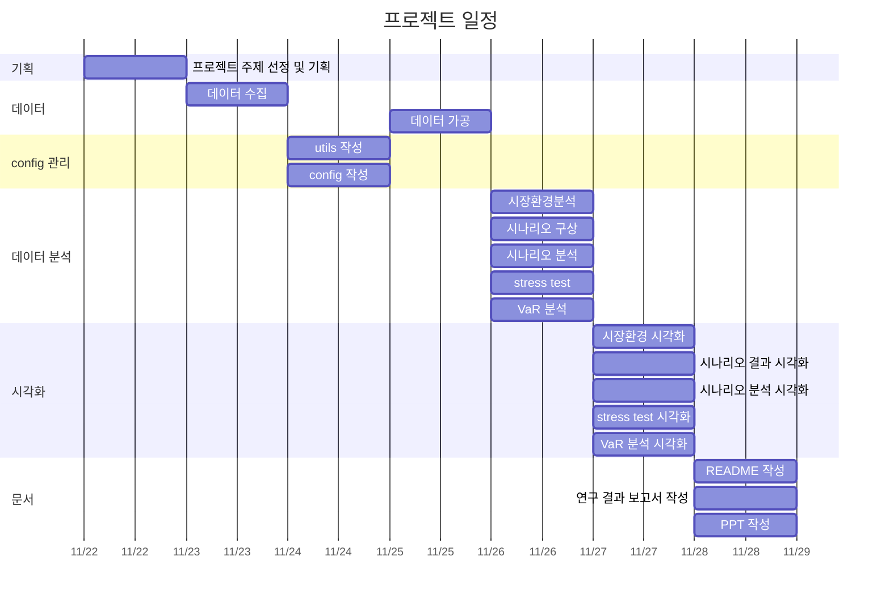
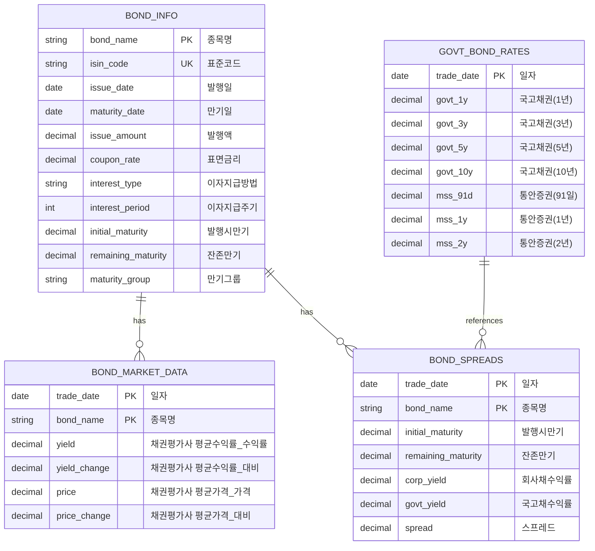
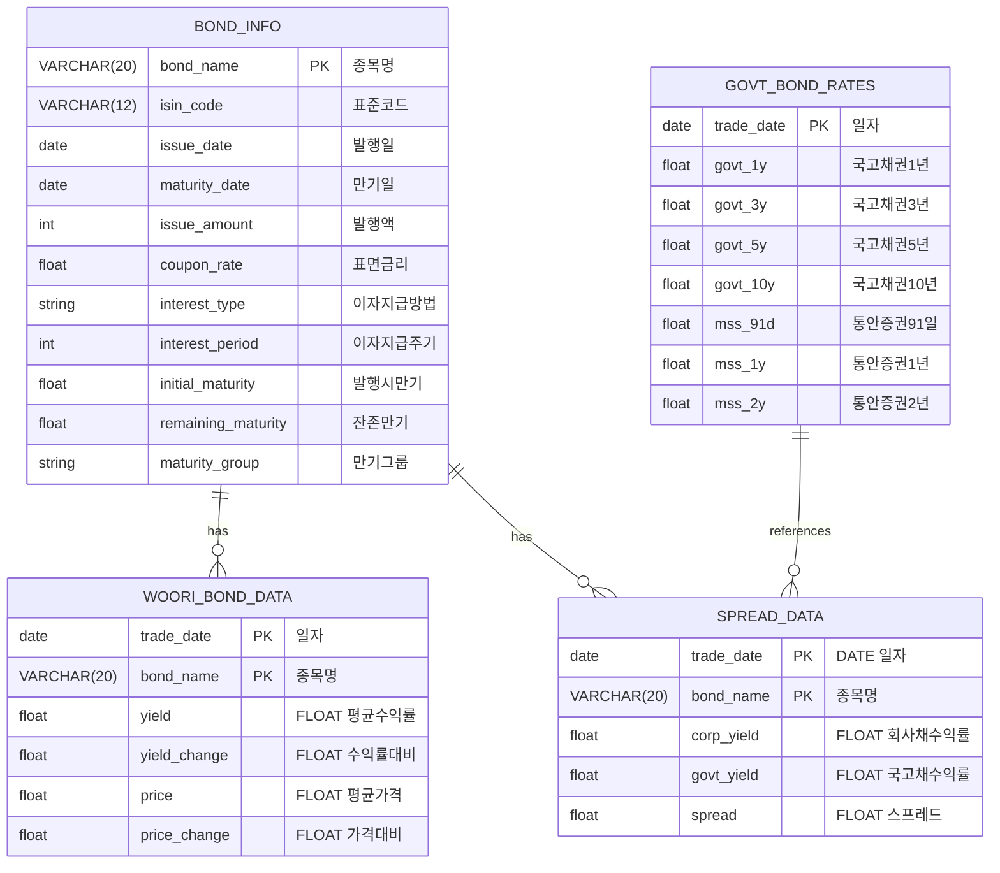

# 우리금융지주 회사채 금리리스크 분석 프로젝트

## 1. 주제 및 목표

우리금융지주 회사채의 금리리스크를 PV01을 통해 분석하고, 만기별 금리 민감도 차이를 분석하는 것을 목표로 합니다.

### 주요 목표

- 우리금융지주 회사채의 금리리스크 특성 파악
- 만기별 PV01 분석을 통한 금리 민감도 측정
- 스트레스 테스트를 통한 잠재 리스크 규모 추정

## 2. 프로젝트 일정



## 3. 기술 스택

#### 언어 


#### 데이터베이스


#### 주요 라이브러리

- pandas: 데이터 처리
- scipy: T-검정
- numpy: 수치 계산
- matplotlib/seaborn: 시각화
- sqlalchemy: 데이터베이스 연동

## 4. 프로젝트 구조

```
risk_management/
├── config/
│   ├── __pycache__/
│   ├── __init__.py
│   └── config_db.py    # db 설정
├── data/
│   ├── processed/
│   │   ├── bond_info/
│   │   │   └── woori_bond_info.csv   # 채권 정보
│   │   ├── market_data/
│   │   │   ├── govt_bond_rates.csv   # 국고채 금리 추이
│   │   │   └── woori_bond_data_[series].csv   # 개별 채권 금리 추이
│   │   └── spread_data/
│   │       └── woori_bond_spreads.csv   # 국고채 금리와 개별 채권의 스프레드
│   └── raw/
│       ├── bond_info/
│       │   └── woori_bond_info.csv
│       └── market_data/
│           ├── woori_bond_yields/
│           │   └── woori_bond_data_[series].txt
│           └── govt_bond_rates.xls
├── docs/
│   ├── analysis/   # 분석 결과 시각화 자료
│   │   ├── covid_period/
│   │   ├── inflation_period/
│   │   ├── market_environment/
│   │   ├── pv01/
│   │   ├── scenarios/
│   │   ├── stress_test/
│   │   └── var/
│   ├── data.md
│   ├── 개념정리.md
│   ├── 시나리오.md
│   └── 연구설계.md
├── risk_management.egg-info/   # 설정 파일
│   ├── dependency_links.txt
│   ├── PKG-INFO
│   ├── SOURCES.txt
│   └── top_level.txt
├── src/
│   ├── __pycache__/
│   ├── analysis/
│   │   ├── past_data/
│   │   │   ├── covid_19.py    # covid_19 시기 데이터 분석(2020~2021)
│   │   │   └── inflation_liquidity.py    # 인플레이션 & 유동성 위기 과거 데이터 분석(2022~2023)
│   │   ├── scenario/
│   │   │   ├── bad_scenario.py
│   │   │   ├── baseline_scenario.py
│   │   │   ├── stress_test.py    # past_data 결과로 stress_test
│   │   │   └── worst_scenario.py
│   │   ├── __init__.py
│   │   ├── market_environment.py    # 시장환경분석
│   │   ├── pv01_analysis.py    # 금리 변동성 분석(PVBP)
│   │   └── VaR.py      # 몬테카를로 VaR 분석
│   ├── data/
│   │   ├── collect/
│   │   │   ├── __init__.py
│   │   │   ├── create_bond_info.py    # 채권 정보 입력 후 csv 파일로 변환
│   │   │   ├── create_db.py    # MySQL 연결 및 데이터베이스 생성
│   │   │   ├── create_spread_data.py   # 스프레드 계산
│   │   │   ├── insert_data_to_db.py    # csv 파일 데이터 MySQL에 삽입
│   │   │   └── test_db.py    # MySQL 연결 테스트 코드
│   │   └── process/
│   │       ├── __init__.py
│   │       └── convert_to_csv.py    # txt, xls 파일 csv 파일로 통일
│   ├── utils/
│   │   ├── __init__.py
│   │   ├── data_loader.py     # 데이터 로드 유틸 코드
│   │   ├── date_utils.py      # 날짜 유틸 코드
│   │   ├── db_queries.py      # 쿼리문 유틸 코드
│   │   └── plot_config.py     # 그래프 템플릿 코드
│   └── visualization/  # 데이터 분석 시각화 코드
│       ├── past_data/
│       │   ├── covid_19.py 
│       │   └── inflation_liquidity.py
│       ├── scenario/
│       │   ├── bad_scenario.py
│       │   ├── baseline_scenario.py
│       │   ├── stress_test.py
│       │   └── worst_scenario.py
│       ├── __init__.py
│       ├── market_environment.py
│       ├── pv01_analysis.py
│       └── VaR.py
├── venv/
├── .env
├── .gitignore
├── README.md
├── requirements.txt    # 패키지 관리
├── __init__.py
└── setup.py    # 설정 파일
```

## 5. 데이터베이스 ERD

### csv 파일 데이터 ERD



### MySQL DB ERD



## 6. 연구 설계

### 분석 방법론

- 시장환경분석
    - 국고채 금리 곡선 분석
    - 신용스프레드 분석
    - 금리 변동성 분석

- PV01 분석
    - 채권별 현금흐름 산출
    - 금리 민감도 계산
    - 만기별 PV01 비교

- 시나리오 분석
    - 역사적 시나리오: 코로나19, 인플레이션 & 유동성 충격
    - 가상 시나리오
        - Baseline : 저성장 기조 지속으로 한국은행의 기준금리 인하
        - Bad : 지정학적 리스크로 금리 인상
        - Worst : Bad 상황 + 기업 부실화로 인한 신용리스크 확대
    - 복합 리스크 요인 분석

- VaR 분석
    - 몬테카를로 시뮬레이션
    - 신뢰수준별 최대손실액 추정
    - Expected Shortfall 계산

## 7. 분석 결과

### 1. 시장환경분석


#### 금리곡선 특성

- 현재 금리곡선은 전반적으로 우상향 형태 (1년 2.866% → 10년 2.976%)
- 3년물에서 소폭 역전 현상 발생 (2.816%)
- 장단기 스프레드(10년-1년): 11bp로 완만한 기울기 유지

#### 신용스프레드 구조

- 중단기 구간(2.99년)에서 가장 높은 스프레드(56.1bp) 관찰
- 장기물로 갈수록 스프레드 축소 경향 (10년물 36.2bp)
- 전반적으로 30-60bp 범위 내 분포

#### 금리 변동성 특성

- 만기가 길어질수록 변동성 증가 추세
- 단기(1년물) 변동성: 11.28%로 상대적 안정
- 장기(10년물) 변동성: 34.13%로 가장 높음
- 3년물 이상 구간에서 급격한 변동성 상승(28-34%)

### 2. PV01 분석


#### 만기별 PV01 분포

- 10년물(우리금융지주2-2): 39.47로 가장 높음
- 5년물(우리금융지주4-2): 10.87로 두 번째
- 3년물 그룹: 4.06~6.83 범위
- 2년물 그룹: 0.41~3.73 범위
- 1년물: 0.48로 가장 낮음

#### 리스크 특성

- 만기 증가에 따라 PV01 지수적 증가
- 장기물(10년)의 금리민감도가 단기물(1년) 대비 약 82배
- 동일 만기 그룹 내에서도 PV01 차이 존재
    - 2년물: 우리금융지주10(3.72) vs 우리금융지주5-1(0.41)
    - 3년물: 우리금융지주7(6.83) vs 우리금융지주4-1(0.39)

#### 리스크 관리 시사점

- 장기물 보유 시 엄격한 금리리스크 관리 필요
- 포트폴리오 구성 시 만기 분산 중요
- 단기물 중심 운용이 금리리스크 축소에 유리

### 3. STESS TEST

#### COVID-19


- 금리 최저점: 2020년 8월 27일 (3년물 기준 0.852%)
- 금리 하락이 두드러진 시기: 2020년 1-3월
- 최대 하락폭: 3년물 기준 2020년 2월 28일 (-0.09%p)

#### 인플레이션/유동성 위기 시기


- 금리 최고점: 2022년 11월 8일 (3년물 기준 4.156%)
- 급격한 금리 상승: 2022년 9월 26일(레고랜드 신용경색 사태)
    - 1년물: +0.262%p
    - 3년물: +0.349%p
- 10bp 이상 상승한 날짜가 39회 기록됨

#### 특징
- COVID-19 시기는 전반적인 금리 하락 추세
- 인플레이션/유동성 위기 시기는 급격한 금리 상승과 높은 변동성 특징
- 금리 변동폭이 COVID-19 시기보다 인플레이션/유동성 위기 시기에 더 큼
- 만기가 길수록 금리 변동성이 더 크게 나타남

#### 채권 포트폴리오 STRESS TEST 결과


#### 시나리오별 최대 손실 시점

- 코로나 위기: 최저점(2020-08-27) 시기에 평균 6.46% 손실
- 인플레이션/유동성 위기: 최고점(2022-11-08) 시기에 평균 26.90% 손실

#### 만기그룹별 취약성

- 10년물이 가장 취약: 최대 164.89% 손실 기록
- 단기물(1년)이 상대적으로 안정적: 최대 2.05% 손실

#### 개별 종목 분석

- 우리금융지주2-2(10년물): 평균 손실률 56.83%로 가장 취약
- 우리금융지주4-1(2.99년물): 평균 손실률 0.53%로 가장 안정적

#### 금리 변동 영향

- 코로나 위기: 최저점에서 83.63bp 상승
- 인플레이션 위기: 최고점에서 419.30bp 상승


### 4. 시나리오 분석

#### 시나리오 가정
| 구분 | BASELINE 시나리오 | BAD 시나리오 | WORST 시나리오 |
|---|---|---|---|
| **금리변동** |
| 2년 이하 | -32bp (-25bp + -7bp 스프레드) | +100bp | +100bp |
| 2-5년 | -27bp (-20bp + -7bp 스프레드) | +75bp | +75bp |
| 5년 초과 | -22bp (-15bp + -7bp 스프레드) | +50bp | +50bp |
| **스프레드 확대** |
| 2년 이하 | 해당없음 | 해당없음 | 60-80bp |
| 2-5년 | 해당없음 | 해당없음 | 100-120bp |
| 5년 초과 | 해당없음 | 해당없음 | 150-180bp |
| **추가 요소** |
| 유동성 프리미엄 | 해당없음 | 해당없음 | (만기/10) × 0.4% × (1 + 현재스프레드 × 0.1) |
| 할인율 | 해당없음 | 해당없음 | 5% + (만기/20) |
| **특징** |
| 시나리오 성격 | 금리인하 및 스프레드 축소 | 금리상승 | 금리상승 + 신용경색 + 유동성 위기 |
| 주요 가정 | 우호적 시장환경 | 금리 스트레스 | 복합적 시장 스트레스 |


#### BASELINE 시나리오 분석 결과


- 금리 인하는 채권 수익률 상승에 긍정적인 영향을 줌
- 채권의 변동성은 만기가 길수록 큼

#### BAD 시나리오 분석 결과


- 금리 상승 시 손실 크기는 만기가 길수록 커짐
- 금리 상승 기간이 늘어날수록 스트레스 강도가 위와 같이 상승함
- 단기채와 장기채는 스프레드가 증가하나 중기채는 스프레드가 축소됨

#### WORST 시나리오 분석 결과


- 장기물일수록 금리리스크와 신용리스크에 취약
- 위기 지속 시 손실 규모가 비선형적으로 증가
- 복합위기 상황에서 리스크 간 상호작용으로 손실 증폭

### 결론

> - **한국의 국채 금리는 COVID-19 시기에 하락했지만 큰 영향은 없었음**
> - **반면, 인플레이션이 본격화되고 신용경색 사건은 신용스프레드, 변동성을 증가시킴**
> - **일반적으로 변동성은 장기채일수록 커지지만, 신용경색 당시 중기채의 변동성이 커짐, 단기적으로 끝날 문제라고 시장의 판단이 보임**
> 
> - **우리금융지주의 현재 발행액은 중기채 비중이 높음**
> - **금리에 급격한 변화가 생길 시 단기, 장기채 위주로 스프레드가 벌어지는 것을 확인할 수 있음**
> - **위기 지속 시 손실 규모가 비선형적으로 증가**
> - **이를 토대로, 우리금융지주의 채권 발행 비중은 금리리스크를 효과적으로 분산했다고 판단할 수 있음**

## 8. 배운 점

1. 데이터 분석을 하기 위한 프로젝트 구조를 배웠습니다.
2. 데이터를 입력하고 MySQL에 데이터를 저장하는 방법을 배웠습니다.
3. SQL 문법 학습을 했습니다.
   - ORDER BY로 일자별 정리를 할 수 있었습니다.
   - Bond_info 테이블과 개별 채권 테이블과 JOIN 한 다음 WHERE 절을 활용하여 1년치 데이터를 채권 발행 정보와 날짜별 수익률을 불러올 수 있었습니다.
4. PV01을 통해 금리 민감도에 대한 학습을 할 수 있었습니다.
5. stress test, 시나리오 설계를 해보는 좋은 경험이 되었습니다. 다음번엔 더 체계적인 설계를 할 수 있을 것 같습니다.
6. VaR 분석을 통한 리스크 정량화를 해봤습니다.
    - VaR는 일반적으로 정규분포를 가정하지만, 금융(채권) 데이터는 대부분 꼬리가 두꺼운(fat tail) 분포를 보인다는 것을 알 수 있었습니다.
    - T-분포는 정규분포보다 꼬리가 두꺼워 극단적 사건 발생 가능성을 더 잘 반영한다는 것을 배웠습니다.
    - 따라서 금융위기와 같은 극단적 상황의 리스크를 더 잘 포착한다는 것을 배웠습니다.