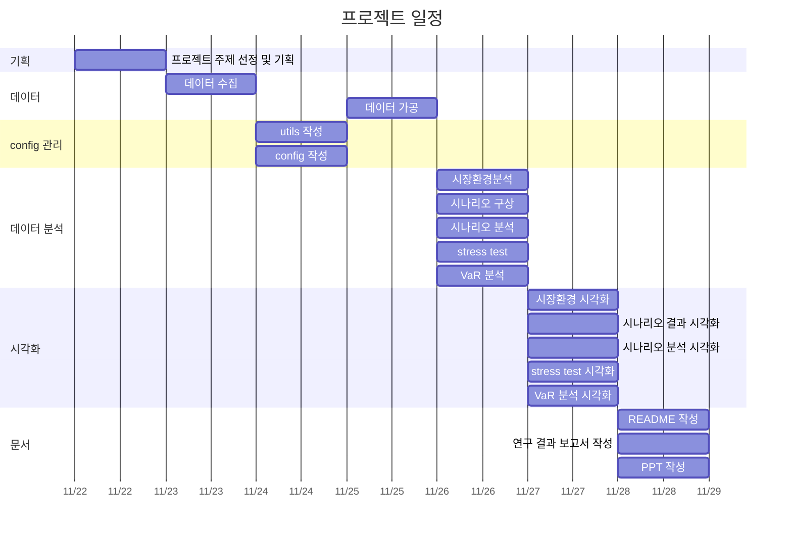
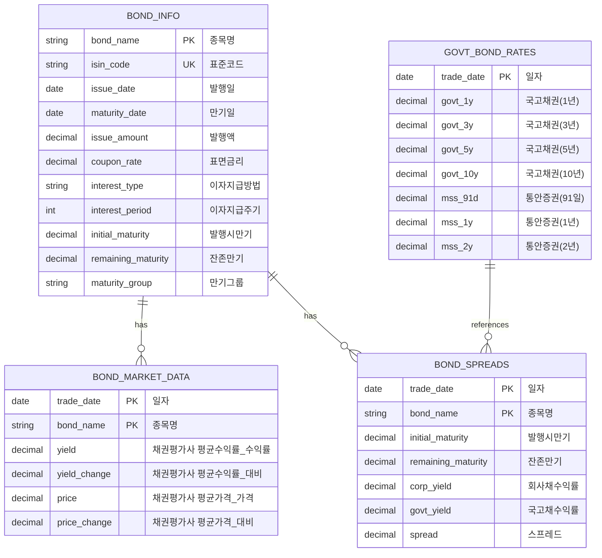
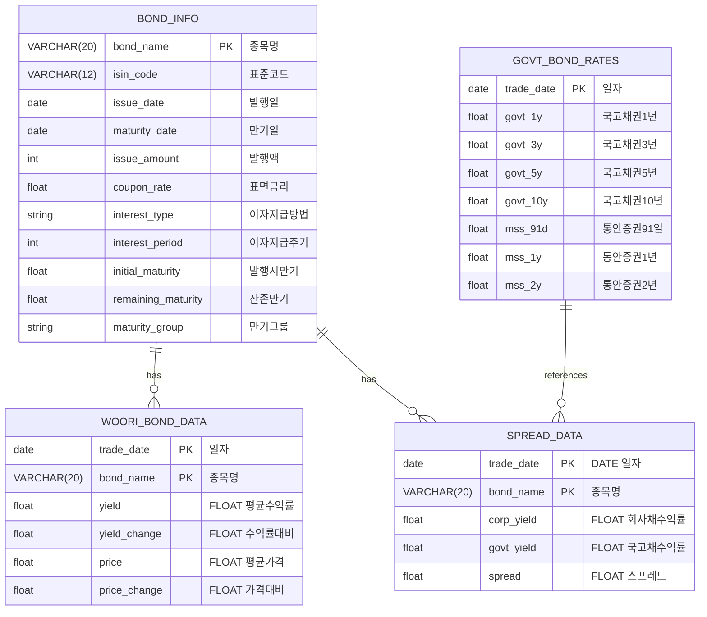

# 우리금융지주 회사채의 PV01을 활용한 금리리스크 분석 프로젝트

## 1. 주제 및 목표

우리금융지주 회사채의 금리리스크를 PV01을 통해 분석하고, 만기별 금리 민감도 차이를 분석하는 것을 목표로 합니다.

### 주요 목표

- 우리금융지주 회사채의 금리리스크 특성 파악
- 만기별 PV01 분석을 통한 금리 민감도 측정
- 스트레스 테스트를 통한 잠재 리스크 규모 추정

## 2. 프로젝트 일정



## 3. 기술 스택

#### 언어 


#### 데이터베이스


#### 주요 라이브러리

- pandas: 데이터 처리
- scipy: T-검정
- numpy: 수치 계산
- matplotlib/seaborn: 시각화
- sqlalchemy: 데이터베이스 연동

## 4. 프로젝트 구조

```
risk_management/
├── config/
│   ├── __pycache__/
│   ├── __init__.py
│   └── config_db.py    # db 설정
├── data/
│   ├── processed/
│   │   ├── bond_info/
│   │   │   └── woori_bond_info.csv   # 채권 정보
│   │   ├── market_data/
│   │   │   ├── govt_bond_rates.csv   # 국고채 금리 추이
│   │   │   └── woori_bond_data_[series].csv   # 개별 채권 금리 추이
│   │   └── spread_data/
│   │       └── woori_bond_spreads.csv   # 국고채 금리와 개별 채권의 스프레드
│   └── raw/
│       ├── bond_info/
│       │   └── woori_bond_info.csv
│       └── market_data/
│           ├── woori_bond_yields/
│           │   └── woori_bond_data_[series].txt
│           └── govt_bond_rates.xls
├── docs/
│   ├── analysis/   # 분석 결과 시각화 자료
│   │   ├── covid_period/
│   │   ├── inflation_period/
│   │   ├── market_environment/
│   │   ├── pv01/
│   │   ├── scenarios/
│   │   ├── stress_test/
│   │   └── var/
│   ├── data.md
│   ├── 개념정리.md
│   ├── 시나리오.md
│   └── 연구설계.md
├── risk_management.egg-info/   # 설정 파일
│   ├── dependency_links.txt
│   ├── PKG-INFO
│   ├── SOURCES.txt
│   └── top_level.txt
├── src/
│   ├── __pycache__/
│   ├── analysis/
│   │   ├── past_data/
│   │   │   ├── covid_19.py    # covid_19 시기 데이터 분석(2020~2021)
│   │   │   └── inflation_liquidity.py    # 인플레이션 & 유동성 위기 과거 데이터 분석(2022~2023)
│   │   ├── scenario/
│   │   │   ├── bad_scenario.py
│   │   │   ├── baseline_scenario.py
│   │   │   ├── stress_test.py    # past_data 결과로 stress_test
│   │   │   └── worst_scenario.py
│   │   ├── __init__.py
│   │   ├── market_environment.py    # 시장환경분석
│   │   ├── pv01_analysis.py    # 금리 변동성 분석(PVBP)
│   │   └── VaR.py      # 몬테카를로 VaR 분석
│   ├── data/
│   │   ├── collect/
│   │   │   ├── __init__.py
│   │   │   ├── create_bond_info.py    # 채권 정보 입력 후 csv 파일로 변환
│   │   │   ├── create_db.py    # MySQL 연결 및 데이터베이스 생성
│   │   │   ├── create_spread_data.py   # 스프레드 계산
│   │   │   ├── insert_data_to_db.py    # csv 파일 데이터 MySQL에 삽입
│   │   │   └── test_db.py    # MySQL 연결 테스트 코드
│   │   └── process/
│   │       ├── __init__.py
│   │       └── convert_to_csv.py    # txt, xls 파일 csv 파일로 통일
│   ├── utils/
│   │   ├── __init__.py
│   │   ├── data_loader.py     # 데이터 로드 유틸 코드
│   │   ├── date_utils.py      # 날짜 유틸 코드
│   │   ├── db_queries.py      # 쿼리문 유틸 코드
│   │   └── plot_config.py     # 그래프 템플릿 코드
│   └── visualization/  # 데이터 분석 시각화 코드
│       ├── past_data/
│       │   ├── covid_19.py 
│       │   └── inflation_liquidity.py
│       ├── scenario/
│       │   ├── bad_scenario.py
│       │   ├── baseline_scenario.py
│       │   ├── stress_test.py
│       │   └── worst_scenario.py
│       ├── __init__.py
│       ├── market_environment.py
│       ├── pv01_analysis.py
│       └── VaR.py
├── venv/
├── .env
├── .gitignore
├── README.md
├── requirements.txt    # 패키지 관리
├── __init__.py
└── setup.py    # 설정 파일
```

## 5. 데이터베이스 ERD

### csv 파일 데이터 ERD



### MySQL DB ERD



## 6. 연구 설계

### 분석 방법론

- 시장환경분석
    - 국고채 금리 곡선 분석
    - 신용스프레드 분석
    - 금리 변동성 분석

- PV01 분석
    - 채권별 현금흐름 산출
    - 금리 민감도 계산
    - 만기별 PV01 비교

- 시나리오 분석
    - 역사적 시나리오: 코로나19, 인플레이션 & 유동성 충격
    - 가상 시나리오
        - Baseline : 저성장 기조 지속으로 한국은행의 기준금리 인하
        - Bad : 지정학적 리스크로 금리 인상
        - Worst : Bad 상황 + 기업 부실화로 인한 신용리스크 확대
    - 복합 리스크 요인 분석

- VaR 분석
    - 몬테카를로 시뮬레이션
    - 신뢰수준별 최대손실액 추정
    - Expected Shortfall 계산

## 7. 분석 결과


## 8. 배운 점

> 1. 데이터 분석을 하기 위한 프로젝트 구조를 배웠습니다.
>
> 2. 데이터를 입력하고 MySQL에 데이터를 저장하는 방법을 배웠습니다.
>
> 3. SQL 문법 학습을 했습니다.
>    - ORDER BY로 일자별 정리를 할 수 있었습니다.
>    - Bond_info 테이블과 개별 채권 테이블과 JOIN 한 다음 WHERE 절을 활용하여 1년치 데이터를 채권 발행 정보와 날짜별 수익률을 불러올 수 있었습니다.
> 4. 