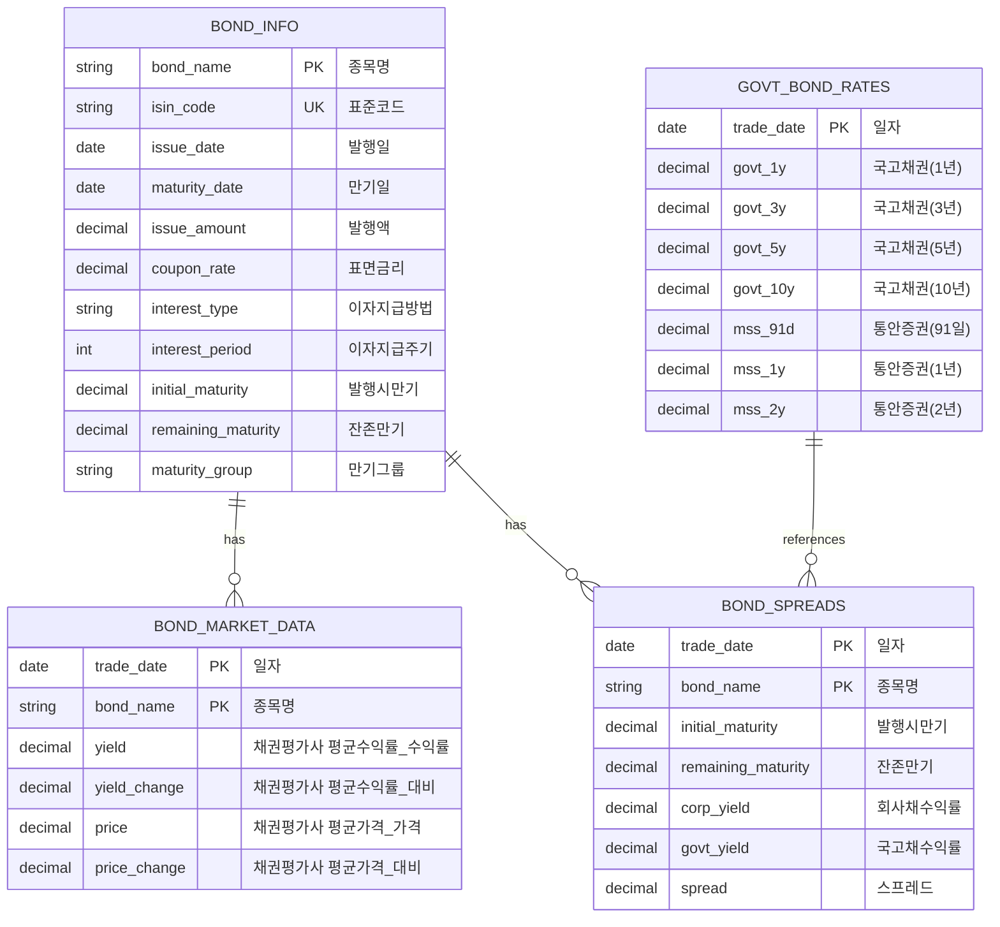
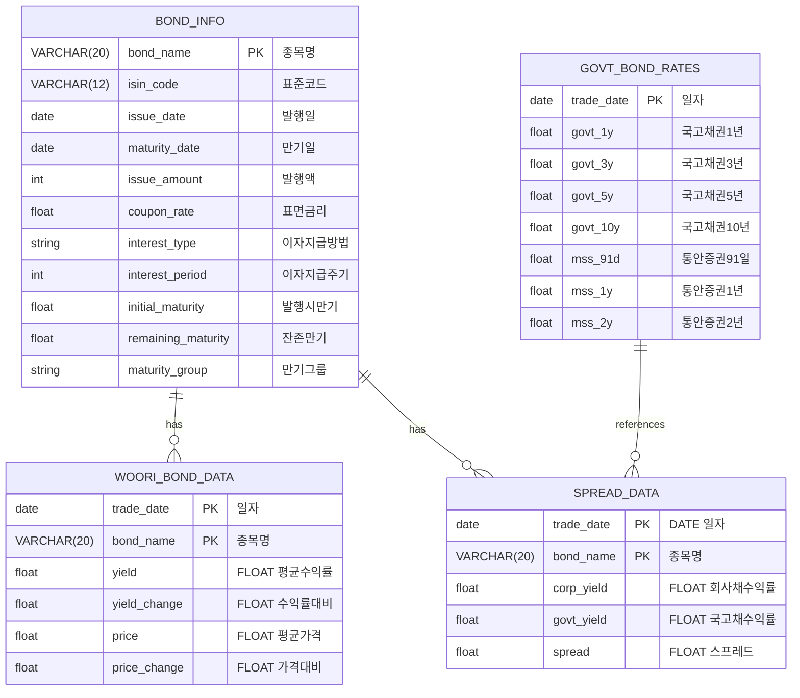

# csv 파일 데이터 ERD

```mermaid
erDiagram
    BOND_INFO ||--o{ BOND_MARKET_DATA : "has"
    BOND_INFO ||--o{ BOND_SPREADS : "has"
    GOVT_BOND_RATES ||--o{ BOND_SPREADS : "references"
    
    BOND_INFO {
        string bond_name PK "종목명"
        string isin_code UK "표준코드"
        date issue_date "발행일"
        date maturity_date "만기일"
        decimal issue_amount "발행액"
        decimal coupon_rate "표면금리"
        string interest_type "이자지급방법"
        int interest_period "이자지급주기"
        decimal initial_maturity "발행시만기"
        decimal remaining_maturity "잔존만기"
        string maturity_group "만기그룹"
    }

    GOVT_BOND_RATES {
        date trade_date PK "일자"
        decimal govt_1y "국고채권(1년)"
        decimal govt_3y "국고채권(3년)"
        decimal govt_5y "국고채권(5년)"
        decimal govt_10y "국고채권(10년)"
        decimal mss_91d "통안증권(91일)"
        decimal mss_1y "통안증권(1년)"
        decimal mss_2y "통안증권(2년)"
    }

    BOND_MARKET_DATA {
        date trade_date PK "일자"
        string bond_name PK "종목명"
        decimal yield "채권평가사 평균수익률_수익률"
        decimal yield_change "채권평가사 평균수익률_대비"
        decimal price "채권평가사 평균가격_가격"
        decimal price_change "채권평가사 평균가격_대비"
    }

    BOND_SPREADS {
        date trade_date PK "일자"
        string bond_name PK "종목명"
        decimal initial_maturity "발행시만기"
        decimal remaining_maturity "잔존만기"
        decimal corp_yield "회사채수익률"
        decimal govt_yield "국고채수익률"
        decimal spread "스프레드"
    }
```

# MySQL DB ERD

```mermaid
erDiagram
    BOND_INFO ||--o{ WOORI_BOND_DATA : "has"
    BOND_INFO ||--o{ SPREAD_DATA : "has"
    GOVT_BOND_RATES ||--o{ SPREAD_DATA : "references"

    BOND_INFO {
        VARCHAR(20) bond_name PK "종목명"
        VARCHAR(12) isin_code "표준코드"
        date issue_date "발행일"
        date maturity_date "만기일"
        int issue_amount "발행액"
        float coupon_rate "표면금리"
        string interest_type "이자지급방법"
        int interest_period "이자지급주기"
        float initial_maturity "발행시만기"
        float remaining_maturity "잔존만기"
        string maturity_group "만기그룹"
    }

    GOVT_BOND_RATES {
        date trade_date PK "일자"
        float govt_1y "국고채권1년"
        float govt_3y "국고채권3년"
        float govt_5y "국고채권5년"
        float govt_10y "국고채권10년"
        float mss_91d "통안증권91일"
        float mss_1y "통안증권1년"
        float mss_2y "통안증권2년"
    }

    WOORI_BOND_DATA {
        date trade_date PK "일자"
        VARCHAR(20) bond_name PK "종목명"
        float yield "FLOAT 평균수익률"
        float yield_change "FLOAT 수익률대비"
        float price "FLOAT 평균가격"
        float price_change "FLOAT 가격대비"
    }

    SPREAD_DATA {
        date trade_date PK "DATE 일자"
        VARCHAR(20) bond_name PK "종목명"
        float corp_yield "FLOAT 회사채수익률"
        float govt_yield "FLOAT 국고채수익률"
        float spread "FLOAT 스프레드"
    }
```